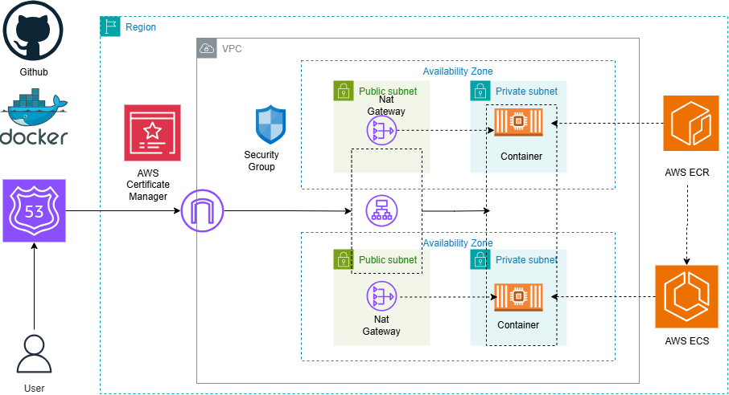

# Static Website Deployment Using Docker, Docker Hub, and AWS, ECS and ECR

This project demonstrates how to containerize and deploy a static website using Docker, push the image to Docker Hub and
 Amazon Elastic Container Registry (ECR), and set up a secure AWS infrastructure with a three-tier VPC and Application Load Balancer (ALB).

## Prerequisites

- Docker installed locally
- AWS CLI installed and configured
- Docker Hub account
- AWS account with permissions to create ECR repositories and networking resources
- Git installed locally

## Steps to Deploy the Static Website

### 1. Setup Your GitHub Repository
- Create a GitHub repository to store your Dockerfile and website files.
- Clone the repository locally:

  git clone <your-repository-url>
  cd <repository-folder>
  
### 2. Create a Dockerfile
- Inside your project folder, create a file named Dockerfile and add your website setup commands.

#### 3. Build and Run the Docker Container Locally
Build your Docker image:
 docker build -t jupiter .
Run the container locally:
 docker run -d -p 8080:80 jupiter
 Open your browser and go to http://localhost:8080 to verify the website is working.

### 4. Push Docker Image to Docker Hub
Create a new repository on Docker Hub
Authenticate Docker with Docker Hub:
docker login -u your-dockerhub-username
Tag the image:
docker tag jupiter your-dockerhub-username/image_name
## Push the image:
docker push your-dockerhub-username/image_name

#### 5. Push Docker Image to Amazon ECR
- Create an Amazon ECR repository: 
 - aws ecr create-repository --repository-name repository_name --region us-east-1 
Authenticate Docker to your ECR repository: 
 - aws ecr get-login-password --region us-east-1 | docker login --username AWS --password-stdin <your-account-id>.dkr.ecr.us-east-1.amazonaws.com 
Tag your Docker image for ECR: 
 - docker push <your-account-id>.dkr.ecr.us-east-1.amazonaws.com/repository_name

 AWS Infrastructure Setup
### 6. Build a Three-Tier VPC in AWS
 Create Public Subnets for your Load Balancer.
 Create Private Subnets for your ECS containers.

### 7. Configure Security Groups
 Application Load Balancer Security Group (ALB-SG):
  - Allow inbound HTTP (port 80) and HTTPS (port 443) traffic from the internet.
 Container Security Group (Container-SG):
  - Allow inbound traffic only from the ALB-SG.

### 8. Create a Target Group
  - Use IP addresses as the target type for your target group.

#### 9. Set up Application Load Balancer (ALB)
  - Associate the ALB with your public subnets and ALB-SG security group.

### 10. Configure DNS and SSL
  - Create a DNS A record in Route 53 pointing to your ALB.
  - Use AWS Certificate Manager (ACM) to request or import an SSL certificate for your domain.
  - Create an HTTPS listener on your ALB:
      - Forward traffic to your target group
      - Attach your SSL certificate to secure your website

  ```bash


